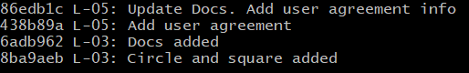

# User agreement 

Please check out License Agreement for personal usage terms and limitations

---

# Math formulas
## Area
- Circle: S = πR²
- Rectangle: S = ab
- Square: S = a²

## Perimeter
- Circle: P = 2πR
- Rectangle: P = 2a + 2b
- Square: P = 4a
  
# Description

This program calculates areas and perimeters of deferrent geometric figures.
The following figures are currently supported:
- Circle
- Square

## Functions

### Circle

``` python
def area(r)
```
This function takes a radius of a circle as a parameter and returns the area of the circle with this radius.

``` python
def perimeter(r)
```
This function takes a radius of a circle as a parameter and returns the perimeter of the circle with this radius.

#### *Example*:

``` python
r = 5
print(area(r))
print(perimeter(r))
```
**Output:** 
```
78.53981633974483
31.41592653589793
```

### Square

``` python
def area(n)
```
This function takes a side of a square as a parameter and returns the area of the square with this side.

``` python
def perimeter(n)
```
This function takes a side of a square as a parameter and returns the perimeter of the square with this side.

#### *Example*:

``` python
n = 5
print(area(n))
print(perimeter(n))
```
**Output:** 
```
25
20
```

# History of changes
<figure>
    
    <figcaption><i>Commits log of repository</i></figcaption>
</figure>
